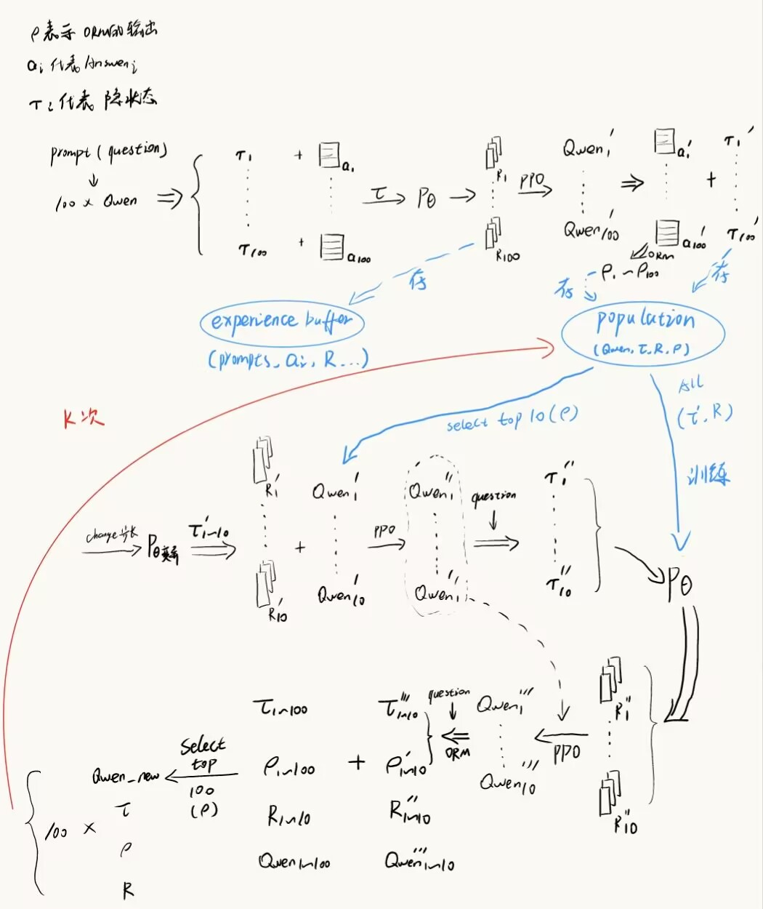

算法主流程与代码
======================================

回顾核心优化问题：我们的目标是最大化种群的平均最终任务表现 

$$\max_{\Pi} \mathbb{E}_{\pi \in \Pi} [\rho(\pi)]$$

其约束条件是种群中的每个策略 $\pi$ 必须满足 

$$\pi = \arg\max_{\pi} \mathbb{E} \left[ \sum r_t - \beta \text{KL} \right]$$

其中过程奖励 $r_t \sim P_\theta(\cdot|\tau)$。

主流程的每一步都与上述数学定义严密对应：

步骤 1：读取数据集 (Prompts & Labels)
--------------------------------------

    raw_data = step_1_load_dataset(dataset_provider)
    # ... 数据格式化处理 ...
    clean_data_for_orm = [{"prompt": p, "label": l} for p, l in zip(prompts_list, labels_list)]

在实现中，Labels（标准答案）是目标客观状态的具体数据形式（例如 ``clean_data_for_orm`` 中的标准标答 ``label``）。它提供了评价的绝对基准，后续计算 $\rho$（ORM 适应度分数）时需要与该基准进行验证。这一步本质上是定义了外层优化目标 $\rho(\pi)$ 的客观参照物。

步骤 2：随机初始化扩散模型
--------------------------

    print(f"  ▶ 步骤 2: 随机初始化扩散模型 ...")
    diffusion_model = step_2_init_diffusion_model(diffusion_model)

扩散模型 $P_\theta$ 负责从大模型的条件信息 $\tau$（Hidden States）中生成连续的过程奖励序列 $R$ 的离散化表达。它是种群探索的起点，后续通过协同训练，它将逐步学会生成能带来高 $\rho$ 分数的奖励信号。这一步实现了动态奖励函数生成器，用于构造内层 PPO 优化约束中的 $P_\theta(\cdot|\tau)$。

步骤 3 & 4：构建初始种群基线 (Initial Population)
-------------------------------------------------

    def build_initial_individual(i: int):
        # 3. 随机初始化 Qwen 模型
        current_qwen = step_3_init_qwen_model(qwen_module, model_index=i)
        # 4.1 生成并收集 PPO 数据与 Tau
        ppo_data, hidden_states = step_4_1_generate_and_collect(current_qwen, prompts_list, labels_list, num_samples=N, model_index=i)
        # 4.2 扩散模型生成初始奖励 R
        rewards = step_4_2_generate_prm_reward(diffusion_model, hidden_states, ppo_data, step_tag_ids=step_tag_id)
        training_data = step_4_3_build_ppo_data(qwen_module, ppo_data, rewards)
        # 4.4 进行 PPO 训练
        trained_qwen = step_4_4_train_qwen_ppo(qwen_module, current_qwen, training_data, model_index=i)
        # 4.5 生成并计算 ORM 分数 ρ
        orm_returns = step_4_5_generate_and_calc_orm(llm_env, trained_qwen, clean_data_for_orm, metric=metric, model_index=i)
        # ... 返回 individual 实例 ...

    population: Population = executor.map(build_initial_individual, list(range(M)))

这里的候选解为种群中并行维护的 $M$ 个 Qwen 权重副本（个体）。这是第一次强制让所有候选策略 $\pi$ 去满足内层约束 $\arg\max_{\pi} \mathbb{E}[\sum r_t]$。系统利用初始弱扩散模型给出的奖励 $R$ 完成首次 PPO 更新，并测出初始的 $\rho$ 分数，从而确立了种群的初始基线与适应度。

步骤 5：协同进化迭代（执行 K 次）
---------------------------------

**5.1 训练扩散模型 (更新裁判)**

    print(f"  ▶ 步骤 5.1: 训练扩散模型 (Diffusion) ...")
    diffusion_model = step_5_1_train_diffusion_with_population(diffusion_model, population)

此步骤提取当前种群的高分轨迹特征，用来微调扩散模型参数 $\theta$，使其学会准确拟合 $R \approx \mathbb{E}[\rho \mid \tau]$，实现裁判模型的自我进化。

**5.2 - 5.3 精英变异与 PPO 强化学习对齐**

    elites = step_5_2_select_elite_population(elite_selector, population, elite_count=cfg.elite.elite_count)

    def mutate_one(args) -> Individual:
        # 5.3.1 【变异】截断扩散生成变异奖励 R'
        mutated_rewards = step_5_3_1_truncated_diffusion_mutate(diffusion_model, tau_data, ...)
        # 5.3.3 训练临时 Qwen (探索)
        temp_qwen = step_5_3_3_train_temp_qwen(qwen_module, ckpt_path, training_data_mutant, ...)
        # 5.3.4 - 5.3.5 生成新轨迹 \tau_{new} 并【对齐】生成标准奖励 R_{new}
        ppo_data_new, hidden_states_new = step_5_3_4_generate_and_collect(...)
        standard_rewards = step_5_3_5_generate_standard_reward(diffusion_model, hidden_states_new, ...)
        # 5.3.7 再次训练 Qwen (巩固)
        final_mutant_qwen = step_5_3_7_train_temp_qwen(qwen_module, temp_qwen, training_data_align, ...)
        # 5.3.8 计算新的 ORM 分数 \rho_{new}
        orm_returns_new = step_5_3_8_generate_and_calc_orm(...)
        return mutant # 返回包含新特征的变异体

截断扩散与对齐机制抛弃了常规的动作空间加噪，转而直接在“奖励空间”生成探索信号 $R'$，促使大模型改变固有的推理习惯。随后利用干净的扩散模型重新打分 $R_{new}$ 进行二次对齐训练。这是求解外层最大化问题的核心引擎，在确保策略始终满足内层 PPO 约束的前提下，强迫策略跳出局部最优，去寻找能带来更高 $\rho$ 分数的全新推理路径。

**5.4 - 5.6 优胜劣汰与基因同步**

    # 5.4 合并种群
    merged_population = step_5_4_add_mutants_to_population(population, mutants)

    # 5.5 保留 top M 个种群
    new_population = step_5_5_keep_top_m(merged_population, M=M)

    # 5.6 物理基因同步 (内存优化版)
    # 将高分变异体深度拷贝覆盖至被淘汰的低分空闲卡槽
    qwen_module._weight_registry[target_idx] = copy.deepcopy(qwen_module._weight_registry[source_idx])
    best_rho = max([ind.rho for ind in population])

物理基因同步执行了严格的达尔文式末位淘汰。这种极致的优胜劣汰构成了向上的进化压力，隐式地最大化了整个种群的平均最终表现 $\mathbb{E}_{\pi \in \Pi} [\rho(\pi)]$，确保 GPU 内存与计算资源永远倾斜给得分最高的大模型权重。

  
### 算法流程图

# 算法主流程

Evolutionary OpenRLHF 的算法可概括为以下两个阶段：

## 阶段一：初始化种群
1. 从基座模型（如 Qwen2.5-7B）克隆出 M 个独立个体。
   population = []
   base_model = load_base_model("Qwen2.5-7B")
   diffusion_model = RandomInitDiffusion()  # 随机初始化的扩散模型
2. 对每个个体 i：
   1. 使用该策略在 N 个 prompt 上生成回答，并记录每步的隐藏状态 `Tau`。
   2. 用一个随机初始化的扩散模型，以 `Tau` 为条件生成奖励序列 `R`。
   3. 将 `(context, response, R)` 组装成 PPO 训练数据，执行一次 PPO 更新。
   4. 在标准答案上评估更新后的策略，得到 ORM 分数 `ρ`。
   model = clone_model(base_model)          # 从基座模型克隆出一个独立个体
   tau, responses = [], []
   for prompt in prompt_dataset[:N]:
       resp, hidden = model.generate(prompt, return_hidden_states=True)
       responses.append(resp)
       tau.append(hidden)                   # hidden 是每一步的隐藏状态列表
   tau = stack_hidden_states(tau)          # 堆叠成统一张量，形状 [N, seq_len, hidden_dim]
   R = diffusion_model.sample_conditioned_on(tau)   # 形状与 Tau 的时间步维度匹配
3. 得到初始种群，每个个体携带其权重、`Tau`、`R` 和 `ρ`。
   individual = {
    "model": model,
    "tau": tau,
    "R": R,
    "rho": rho
   }
   population.append(individual)

## 阶段二：进化迭代（重复 K 代）
每一代执行以下步骤：

### 1. 训练扩散模型
选取当前种群中 ρ 最高的 `top_k` 个个体，用它们的 `(Tau, R)` 对训练扩散模型（监督学习，让扩散模型学会从隐状态预测高分奖励）。
   sorted_pop = sorted(population, key=lambda x: x["rho"], reverse=True)
   top_individuals = sorted_pop[:top_k]
### 2. 选择精英种群
根据 ρ 对种群排序，保留前 `elite_ratio` 比例的个体进入精英池。
   sorted_population = sorted(population, key=lambda x: x["rho"], reverse=True)
   num_elites = int(len(population) * elite_ratio)
   elites = sorted_population[:num_elites]
### 3. 对每个精英个体进行变异与对齐
对精英池中的每个个体，生成一个变异后代：

- **变异**：对精英的奖励序列 `R` 应用截断扩散——先加噪，再反向去噪若干步，得到变异奖励 `R'`。
  for elite in elites:
    # 3a. 变异：截断扩散
    # 先加噪到中间步 t_mutate
    t_mutate = T // 2   # 示例：加噪到一半时间步
    R_noisy = diffusion_model.q_sample(elite["R"], t_mutate)
    # 反向去噪若干步（从 t_mutate 到 0 的不完全去噪，可提前停止）
    R_prime = diffusion_model.partial_denoise(R_noisy, t_mutate, stop_step=stop_early_step,
                                              condition=elite["tau"])
- **初步训练**：用 `R'` 对精英策略进行 PPO 训练，得到一个临时策略。
   # 3b. 初步训练：用变异奖励 R' 对精英策略进行 PPO 更新（得到临时策略）
    temp_model = clone_model(elite["model"])
    ppo_data_mut = build_ppo_batch(prompts=prompt_dataset,
                                   responses=collect_responses(elite["model"], prompt_dataset),
                                   rewards=R_prime)
    PPOTrainer(temp_model).step(ppo_data_mut)
- **探索新轨迹**：使用临时策略生成新的回答和隐状态 `τ_new`。
  tau_new, responses_new = [], []
    for prompt in prompt_dataset:
        resp, hidden = temp_model.generate(prompt, return_hidden_states=True)
        responses_new.append(resp)
        tau_new.append(hidden)
    tau_new = stack_hidden_states(tau_new)
- **对齐**：将 `τ_new` 送入扩散模型，获得干净的标准奖励 `R_new`，并以此再执行一次 PPO 更新，确保策略与当前扩散模型的评估一致。
  R_new = diffusion_model.sample_conditioned_on(tau_new)
- **评估**：最终生成答案并计算新的 ORM 分数 `ρ_new`。
   rho_new = evaluate_orm(aligned_model, eval_prompts, ground_truth_answers)
一个精英个体变异后产生一个新个体，包含新的权重、`τ_new`、`R_new` 和 `ρ_new`。
   new_offspring.append({
        "model": aligned_model,
        "tau": tau_new,
        "R": R_new,
        "rho": rho_new
    })

### 4. 种群更新
将所有新产生的个体加入种群，保留 ρ 最高的 M 个个体，形成新一代种群。
   combined_population = population + new_offspring
   combined_population.sort(key=lambda x: x["rho"], reverse=True)
   population = combined_population[:M]

### 5. 记录
记录当前种群的最佳 ρ，用于监控进化趋势。
   best_rho = population[0]["rho"]
   print(f"Generation {gen}: best rho = {best_rho:.4f}")
   wandb.log({"generation": gen, "best_rho": best_rho})
