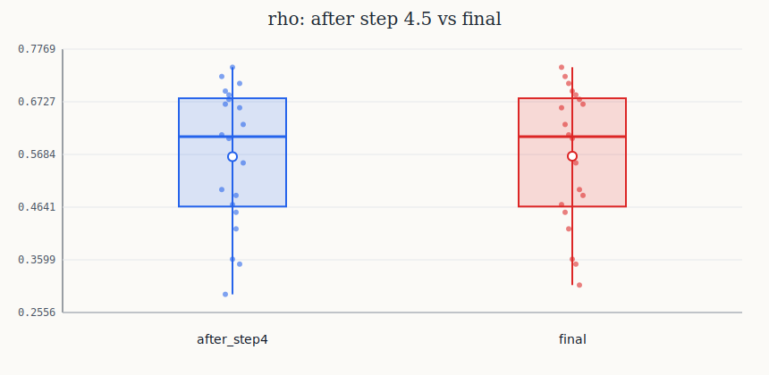
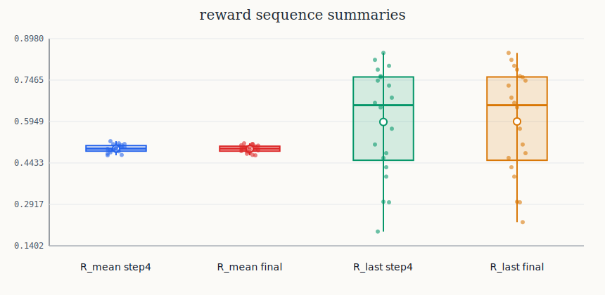
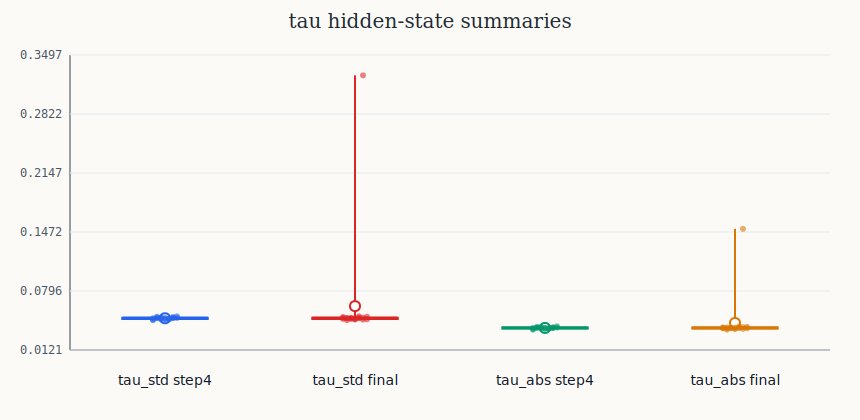

# tau/R/rho结果分析与改进建议

主流程中 **4.5 步后收集到的 `tau/R/rho`** 与 **完整进化流程 5.6 步后收集到的 `tau/R/rho`** 的对比结果。

从整体实验现象来看：

> 当前完整进化流程跑完后，`rho` 没有明显提升，`R` 的奖励分布基本没有发生有效变化，只有 `tau` 出现了少数明显偏移或异常个体。  
> 这说明目前扩散奖励还没有真正和高 ORM 分数绑定起来，PPO 更新更多表现为无效探索，而不是稳定地推动 Qwen 个体向更高 `rho` 方向进化。


---

## 1. `rho` 对比分析：完整进化后几乎没有提升



从 `rho` 箱线图可以看到，4.5 步后和完整流程后的 `rho` 分布几乎重合。

大致结果如下：

| 指标 | 4.5 步后 | 完整步骤后 | 变化 |
|---|---:|---:|---:|
| 平均值 | 约 0.5711 | 约 0.5720 | 极小提升 |
| 中位数 | 约 0.6108 | 约 0.6108 | 几乎不变 |
| 最大值 | 约 0.7480 | 约 0.7480 | 没有提升 |
| 最小值 | 约 0.2986 | 约 0.3170 | 略微提升 |

这说明：

> 完整进化流程并没有产生明显强于初始种群的 Qwen 个体。

如果算法有效，完整进化后的 `rho` 箱线图应该整体向上移动，例如中位数变高、上四分位数变高、最大值变高。但当前结果中，最大值和中位数几乎完全不变。

这说明 5.1 到 5.6 的进化步骤目前作用比较弱。它可能只是替换掉了个别低分个体，使最低分略微提高，但没有真正推动整个种群向更高 ORM 分数进化。

---

## 2. `R` 对比分析：奖励分布没有发生有效进化



奖励图中主要对比了两个指标：

- `R_mean`：奖励序列的平均值；
- `R_last`：奖励序列最后一步或最后一个 token 的奖励值。

### 2.1 `R_mean` 基本不变

从图中可以看到：

\[
R_{mean}^{step4} \approx 0.506
\]

\[
R_{mean}^{final} \approx 0.505
\]

两者几乎没有区别。

这说明扩散模型生成的奖励序列整体均值仍然集中在 0.5 附近，没有因为完整进化过程而明显变大或变得更有区分度。

如果扩散模型真的学会了“高 `rho` 个体对应什么样的奖励”，那么完整流程后的奖励分布应该出现某种变化，例如：

- 高分个体的奖励整体更高；
- 低分个体的奖励整体更低；
- 奖励方差增加，区分度更强；
- 奖励与 `rho` 之间出现明显正相关。

但当前 `R_mean` 几乎完全不变，说明扩散模型可能只是学到了普通的奖励分布，而没有学到与高 ORM 表现相关的奖励偏好。

### 2.2 `R_last` 有波动，但没有转化为更高 `rho`

`R_last` 的分布本身比 `R_mean` 更宽，说明最后一步奖励确实存在一定多样性。

但是完整流程后：

- `R_last` 的中位数几乎不变；
- `R_last` 的最大值几乎不变；
- 平均值只从约 0.6035 变到约 0.6052；
- 分布没有明显整体上移。

这说明：

> 扩散模型确实能产生不同的奖励值，但这种奖励变化没有有效指导 Qwen 获得更高的 `rho`。

换句话说，当前奖励变异可能只是数值上的扰动，而不是有方向的优化信号。

---

## 3. `tau` 对比分析：完整流程后出现少数异常偏移个体



`tau` 图主要展示 hidden states 的变化，其中包括：

- `tau_mean`：hidden states 的均值；
- `tau_std`：hidden states 的标准差；
- `tau_abs`：hidden states 绝对值均值或绝对幅度。

### 3.1 4.5 步后的 `tau` 比较稳定

4.5 步后，`tau_std` 大概集中在：

\[
0.051 \sim 0.055
\]

`tau_abs` 大概集中在：

\[
0.040 \sim 0.044
\]

说明初始种群经过一次 PPO 更新后，不同 Qwen 个体的 hidden states 差异并不大，整体比较稳定。

### 3.2 完整流程后出现异常 `tau`

完整进化后，图中出现了明显异常值：

\[
\max(tau\_std) \approx 0.331
\]

\[
\max(tau\_abs) \approx 0.155
\]

这说明有一两个个体的 hidden states 发生了非常明显的偏移。

但是要注意：

> `tau` 偏移变大，并不代表模型能力变强。

因为从 `rho` 图看，完整流程后的 ORM 分数并没有明显提高。所以这些异常的 `tau` 更可能代表：

- PPO 更新把模型推到了比较偏的表示区域；
- 扩散生成的变异奖励 `R'` 造成了不稳定训练；
- 个别 Qwen 生成行为发生变化，但没有带来更好的答案；
- 模型内部状态变化了，但外部任务表现没有提升。

因此，当前的 `tau` 异常更像是“无效探索”，而不是“有效进化”。

---

## 4. 当前实验暴露出的问题

根据三张图，可以得到一个判断：

> 当前扩散模型可能只学到了 `R` 的普通分布，即 `p(R|tau)`，但没有真正学到“高 `rho` 个体对应的奖励应该长什么样”。

也就是说，当前扩散模型可能在做：

\[
p(R|\tau)
\]

但算法真正需要的是：

\[
p(R|\tau, \rho \text{ high})
\]

或者更直接地说：

\[
R = f(\tau, \rho)
\]

如果 4.1 中训练扩散模型时只用了普通扩散损失：

\[
L_{diff}=\|\epsilon-\epsilon_\theta(R_t,t,\tau)\|^2
\]

那么扩散模型只是在学习如何复原奖励 `R`，它并不知道哪个 `R` 对应更高的 `rho`。

这会导致一个问题：

- 高分个体的奖励被学习；
- 低分个体的奖励也被学习；
- 扩散模型最后学到的是所有奖励的平均模式；
- 生成出来的 `R` 缺少对高 ORM 行为的偏好；
- PPO 用这种奖励训练 Qwen，自然难以提升 `rho`。

这正好解释了当前结果：

1. `R_mean` 基本不变；
2. `R_last` 基本不变；
3. `rho` 基本不变；
4. 少数 `tau` 出现异常漂移，但没有带来性能提升。

---

## 5. 改进方向一：让 `rho` 参与扩散模型训练

当前最重要的改进是：不要让扩散模型平等学习所有个体的 `R`，而是让高 `rho` 个体的奖励对扩散模型影响更大。

可以把普通扩散损失：

\[
L_{diff}=\|\epsilon-\epsilon_\theta(R_t,t,\tau)\|^2
\]

改成带 `rho` 权重的形式：

\[
L_{diff}=w(\rho_i)\|\epsilon-\epsilon_\theta(R_{i,t},t,\tau_i)\|^2
\]

其中权重可以用 softmax 形式：

\[
w(\rho_i)=\frac{\exp(\rho_i/\alpha)}{\sum_j\exp(\rho_j/\alpha)}
\]

这里的 `alpha` 是温度系数。

- `alpha` 越小，高 `rho` 个体权重越大；
- `alpha` 越大，不同个体权重差异越小。

这样做的意义是：

> 让扩散模型重点学习高 ORM 个体对应的奖励模式，而不是平均学习所有个体。

---

## 6. 改进方向二：把 `rho` 作为扩散模型的条件输入

除了给 loss 加权，还可以直接把 `rho` 输入扩散模型，让扩散模型知道当前奖励应该朝什么目标生成。

原来的条件扩散可能是：

\[
\epsilon_\theta(R_t,t,\tau)
\]

可以改成：

\[
\epsilon_\theta(R_t,t,\tau,\rho)
\]

训练时输入真实 `rho_i`，推理或变异时可以指定一个较高的目标分数，例如：

\[
\rho_{target}=\max(\rho)+\delta
\]

这样扩散模型生成奖励时，不只是知道当前 hidden states 是什么，还知道目标是生成更接近高分个体的奖励。

这相当于从：

\[
p(R|\tau)
\]

改成：

\[
p(R|\tau,\rho)
\]

这会更符合你的算法目标。

---

## 7. 改进方向三：检查变异个体是否真的进入下一代

目前 `rho final` 和 `rho step4` 几乎一样，很可能说明：

> 5.3 产生的新个体没有超过原来的老个体，所以 5.5 选择 Top M 时，大部分留下的仍然是原始个体。

建议在代码里额外记录：

```text
final_population 中 old 个体数量
final_population 中 mutated 个体数量
old 个体平均 rho
mutated 个体平均 rho
mutated 个体最大 rho
mutated 个体是否超过当前 best rho
```

如果发现 mutated 个体基本没有进入最终种群，就说明 5.3 的奖励变异没有实际收益。

这种情况下，需要继续检查：

1. `R'` 的变异幅度是否过小；
2. `R'` 是否过大导致 PPO 不稳定；
3. PPO 训练步数是否太少；
4. PPO 学习率是否太大或太小；
5. 变异后的 Qwen 是否真的从精英权重开始训练；
6. `rho_new` 是否真的重新计算，而不是复用了旧分数。

---

## 8. 改进方向四：定位 `tau` 异常个体

完整流程后 `tau_std` 和 `tau_abs` 出现明显异常值，因此建议定位异常个体。

需要打印：

```text
max tau_std 的个体编号
该个体的 rho
该个体的 R_mean
该个体的 R_last
该个体的 response 长度
该个体的 response 内容
该个体是否来自 mutated elite
```

如果该个体 `tau` 很大，但 `rho` 不高，说明它不是有效进化。

如果该个体的回答内容很奇怪，例如：

- 重复输出；
- 过长输出；
- 格式崩坏；
- 答非所问；
- reasoning 内容异常；

那么需要对 PPO 更新增加约束，例如 KL 惩罚、长度惩罚或者 reward clipping。

---


## 9. 结论

根据当前三张图，可以得到如下结论：

> 完整进化流程目前没有明显提升 ORM 分数。`rho` 的中位数、最大值和整体分布几乎不变，说明进化过程没有产生明显优于初始种群的 Qwen 个体。奖励序列方面，`R_mean` 和 `R_last` 在完整流程前后几乎保持一致，说明扩散模型生成的奖励没有随着高分个体产生有效进化。Hidden states 方面，完整流程后出现少数 `tau_std` 和 `tau_abs` 异常增大的个体，但这些变化没有带来 `rho` 提升，因此更可能是无效探索或 PPO 训练漂移。

因此，当前算法的主要问题不是主流程设计错误，而是：

> `rho` 对扩散模型训练的指导作用不够强。

后续应重点将扩散模型从：

\[
p(R|\tau)
\]

改进为：

\[
p(R|\tau,\rho \text{ high})
\]

或者在扩散 loss 中加入基于 `rho` 的权重：

\[
L_{diff}=w(\rho_i)\|\epsilon-\epsilon_\theta(R_{i,t},t,\tau_i)\|^2
\]

这样扩散模型才会更偏向学习高分个体的奖励模式，进而让 PPO 更新有更明确的优化方向。

---

## 10. 下一步计划

下一轮将优先做以下几件事：

1. 在扩散模型训练 loss 中加入 `rho` 权重；
2. 记录每一代 mutated 个体是否进入最终 Top M；
3. 找出完整流程后 `tau_std` 最大的异常个体，查看它的回答内容和 `rho`；
4. 画 `rho` 与 `R_mean/R_last/tau_std/tau_abs` 的散点图；
5. 检查 PPO 训练中的 KL 惩罚、reward clipping 和学习率设置；
6. 检查 `rho_new` 是否每次都重新计算，避免误用旧分数。

如果这些检查完成后发现 `rho` 与 `R` 仍然没有相关性，就需要进一步修改扩散模型结构，让 `rho` 显式作为条件输入。
